#All Weather V1 - Performance Analysis (Brief)

**Marcus Williamson - 08/09/15**

---
Please find the supplementary optimisation Notebooks [here](https://github.com/ArtificialInvestor/algo-optimisation/tree/master/All%20Weather%20V1)

#####Format:

1. Introduction
1. Backesting Optimised Strategies
1. Combining Optimised Strategies
1. Review of Results

##1. Introduction

This Notebook highlights the backbone to the approach of the Artificial Investor ideology:

**Combining diversified alpha generators to deliver consistent returns**

We aim to show here that very basic quantitatively driven strategies that generate returns from different market behaviours when combined can provide a more *desirable* and relaiable return stream that can be leveraged to generate a superior return to the market, although we must be clear that this is **not** the objective.

Below we compare the different strategies alone vs when combined in any particular combination is somewhat inferior to the quality of returns stream generated when all are combined together.

---
**Desirable Returns:**

Desirable returns is understandably a very subjective and a weak term, here I shall briefly outline what we determine as reliable. Risk free rate is based on US Treasuries, see [here](https://research.stlouisfed.org/fred2/categories/116). An algorithm's returns ideally have:

* High [Sharpe Ratio](https://en.wikipedia.org/wiki/Sharpe_ratio) - Deviation risk measure (Reward to variability)
* High [Stability](https://en.wikipedia.org/wiki/Coefficient_of_determination) - R-squared of a linear fit to the returns
* High [Alpha][] - Active return of investment
* High [Calmar Ratio](https://en.wikipedia.org/wiki/Calmar_ratio) - Compound annual returns divided by Max Drawdowb
* High [Sortino Ratio](https://en.wikipedia.org/wiki/Sortino_ratio) - Variation on Sharpe penilising downside volatility only
* High [Omega Ratio](https://en.wikipedia.org/wiki/Omega_ratio) - Probabilty weighted ratio of returns vs losses
* Low [Max Drawdown][] - Highest to lowest point since inception
* Low [Volatility][] - Degree of variation in returns
* Low [Beta][] - Exposure to general market movements
* Low [Kurtois](https://en.wikipedia.org/wiki/Kurtosis) - "Peakedness" of returns vs Normal Distribution (High = Fat tails
* Positive [Skew](https://en.wikipedia.org/wiki/Skewness) - "Skewdness" of returns vs Normal Distribution

The explicit valuations depend entirely on circumstances such as strategy being tested, the current market regime it is tested over, and the slippage or market impact models being implemented. However one is able to compare apples to apples when looking at the same algorithms's strategies in various combinations over the same periods. 

Please note: the securities / ETF's chosen to trade are simply for illustrative purpose, no thought has gone into what pair of stocks to trade, it has simply been taken from wikipedia.

---
**Dynamic Rebalancing**

A dynamic monthly rebalancing has been implemented for the first two strategies in this algorithm, the frequency was chosen after reviewing the peformance. This is based closely on the Kelly Criterion, looking at the covariance of returns, see more [here](https://www.quantstart.com/articles/Money-Management-via-the-Kelly-Criterion). 

In the backtests I compare the peformance of the strategies with and without this dynamic rebalancing. There has been no independent leverage control implemente which could theoretically (and should in practice) force a strategy to zero leverage if it consistently underperforms. This is something I hope to implement in my next project, along with fixing two potential problems, which I cover below.

---
**Known Issues**

* Initial investigation presents the potential issue that the daily returns may be being incorrectly calculated for the strategies which hold some positions over night. 
* Leverage control ensures the algorithm does not exceed a leverage of 1.05, however on three occasions over 8 years this leverage is excedeeded momentarily, I believe this is a bug in the timing of orders vs leverage calculation.

Although both these issues arguably have little affect to my performance it is of the upmost importance that quantitatively driven strategies have failsafe watertight architecture that **does not have bugs**. Flaws in the programming present the greatest danger to quantiatively driven models.

---
**Transaction Costs & Slippage**

* Applicable fees can be found [here](https://www.interactivebrokers.com/en/index.php?f=commission&p=stocks1&ns=T), the minimum order charge is 1 USD per order and 0.005 USD per share for fixed tier pricing
* Slippage model implemented can be read about [here](https://www.quantopian.com/help#ide-slippage)

In both cases the actual algorithm contains more conservative parameters for costs and slippage (per share costs is 200% above fixed rate), in order to create a realistic performance in live foward test with funding. 

[Alpha]:https://en.wikipedia.org/wiki/Alpha_(finance)
[Max Drawdown]:https://en.wikipedia.org/wiki/Drawdown_(economics)
[Volatility]:https://en.wikipedia.org/wiki/Volatility_(finance)
[Beta]:https://en.wikipedia.org/wiki/Beta_(finance)

##2. Backtesting Optimised Strategies

The original algorithm has been optimised over a total six year period in two three year segments, the parameters have been selected with a focus on consistency and stability of returns rather than maximal performance 

**In Sample Backtest:** 01/01/07 - 01/01/13

**Out-of-sample Backtest:** 01/01/13 - 01/01/15

###Mean Reversion

Designed to generate returns in QE tainted environments under the assumption that a stock's price will tend to move to the average price over time. See more [here](https://en.wikipedia.org/wiki/Mean_reversion_(finance).

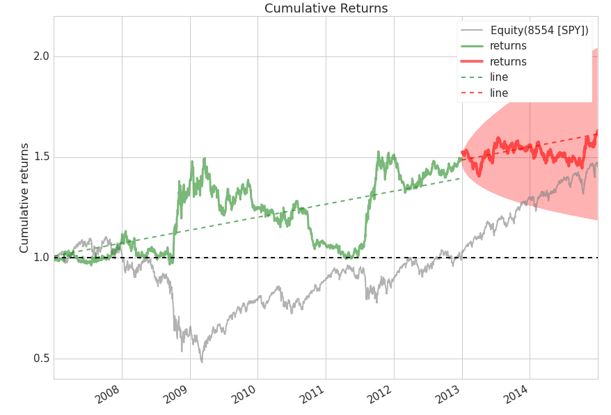

The strategy has a naturally contrarian approach, it appears to profit well from sudden drops, however gives back much of its gains in trending periods. This could clearly be enhanced with a more sophisticated reversion model along with absolute stoplosses and order feathering.

The strategy struggles with the bull run in 2013, however generates considerable retuns over the October 15 Treasury flash crash event. Simialrity of returns are good, we can see the distribution curves fitting one another fairly well with tighter tails and more peak suggesting a generally improved performance over the Out-of-sample period. 

###Momentum

Generates returns from market trends, it works especially well under sustained periods of market growth. Read more [here](https://en.wikipedia.org/wiki/Momentum_investing).

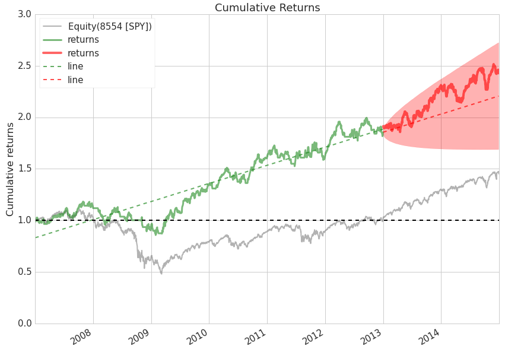

This strategy monopolises on bullish trends, its stoploss design prevented it from experiencing a large drawdown over the subprime crisis. Over various events the returns are largely flat as the stoploss is hit to prevent losses.

###Pairs Trading

Trading the converging relationship between two correlated stocks in attempt to hedge market and sector risk (market neutral position). This provides a return stream without any major trend / reversion taking place. Read more [here](https://en.wikipedia.org/wiki/Pairs_trade)

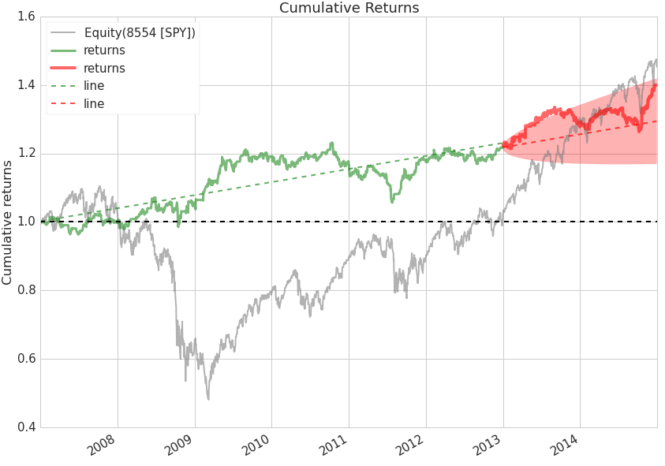

The pairs trading strategy performs well over the duration of the backtest, it experiences one major drawdown, otherwise it is not considerably effeted by general marktet direction.

Pairs strategy, like the momentum strategy, outperforms its expectations in the out of sample period. The returns distribution show some heavy tails for backtest and out-of-sample, this is not ideal, but the skew is positive.

##3. Combined Strategies

Here we examine the performance of the strategies when combined with and without the dynamic rebalancing. The advantage of stacking these strategies, as covered previously, are that the returns are diversified and stabilisied with the ability to generate consistent returns over varying market behaviour.

####Mean Reversion & Momentum - No Rebalance

The combination of Mean reversion and Momentum provides a complementary returns stream which delivers on violent drops and trending periods.

####Mean Reversion & Momentum - Dynamic Rebalancing

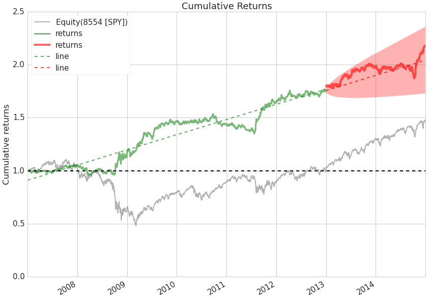

The rebalancing version of the Mean Reversion & Momentum strategy acutally underperforms the non rebalanced strategy in the backtest period. This may be due to the optimisation taking place without dynamic rebalancing in effect.

####Momentum & Pairs Trading

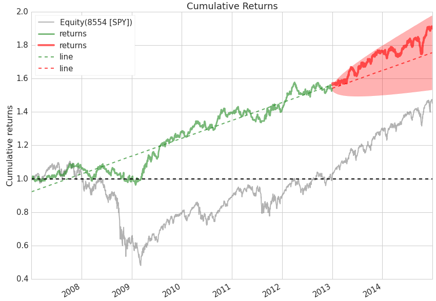

Again an enhanced performance as a result of combining the two diversified strategies, in this case the Pairs strategy helps to make the returns stream more consistent

####Mean Reversion & Pairs Trading

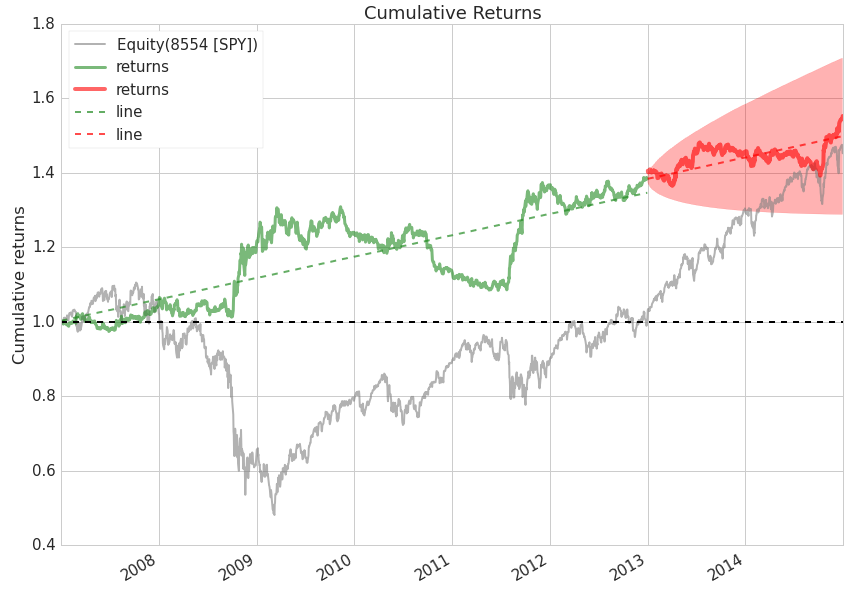

The combination of Mean reversion and Pairs strategy is less stable with larger swings, however it provides a negatively correlated returns stream as reflected with its negative Beta

###All Strategies - Mean Reversion, Momentum, Pairs Trading - No Rebalance

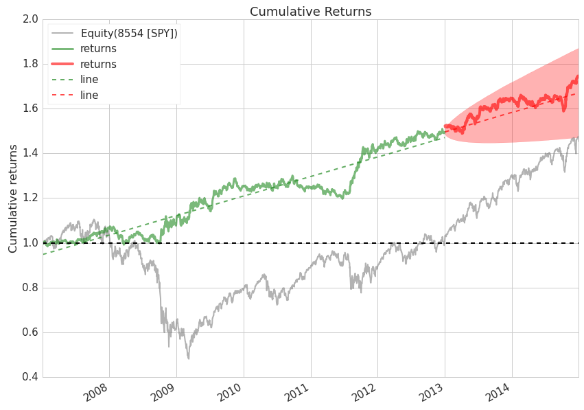

Without rebalancing we see the combination of all three strategies yeilding a smoother returns stream apart from the vigerous returns over mid 2011, where the effects of the mean reversion have contributed.

###All Strategies - Mean Reversion, Momentum, Pairs Trading - Dynamic Rebalancing

    #2007-2015 In-sample + Out-of-sample
    stack4 = get_backtest('55f7edaaae2b840e1335d784')
    stack4.create_returns_tear_sheet(live_start_date='2013-1-1')

    100% Time: 0:00:13|###########################################################|
    Entire data start date: 2007-01-03 00:00:00+00:00
    Entire data end date: 2014-12-31 00:00:00+00:00
    
    
    Out-of-Sample Months: 24
    Backtest Months: 71
                       Backtest  Out_of_Sample  All_History
    annual_return          0.08           0.09         0.08
    annual_volatility      0.08           0.05         0.08
    sharpe_ratio           0.95           1.64         1.06
    calmar_ratio           0.92           1.73         0.95
    stability              0.91           0.75         0.95
    max_drawdown          -0.09          -0.05        -0.09
    omega_ratio            1.19           1.35         1.22
    sortino_ratio          1.46           3.10         1.64
    skewness               0.42           1.60         0.53
    kurtosis               5.49          10.57         6.53
    alpha                  0.08           0.04         0.07
    beta                   0.08           0.25         0.09
    
    Worst Drawdown Periods
       net drawdown in %                  peak date                valley date  \
    1               8.50  2007-12-10 00:00:00+00:00  2008-03-20 00:00:00+00:00   
    0               7.42  2010-09-24 00:00:00+00:00  2011-07-25 00:00:00+00:00   
    3               6.94  2008-11-04 00:00:00+00:00  2008-11-18 00:00:00+00:00   
    2               5.09  2014-07-03 00:00:00+00:00  2014-10-10 00:00:00+00:00   
    4               3.08  2013-11-29 00:00:00+00:00  2014-02-05 00:00:00+00:00   
    
                   recovery date duration  
    1  2008-10-27 00:00:00+00:00      231  
    0  2011-08-31 00:00:00+00:00      244  
    3  2009-01-02 00:00:00+00:00       44  
    2  2014-10-30 00:00:00+00:00       86  
    4  2014-07-01 00:00:00+00:00      153  
    
    
    2-sigma returns daily    -0.009
    2-sigma returns weekly   -0.018
    dtype: float64

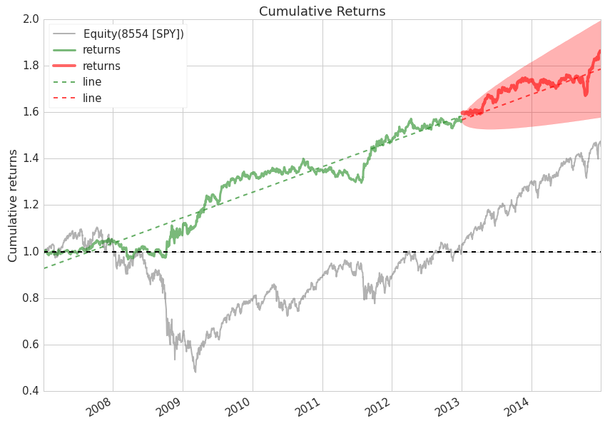

We can clearly see a strong performance from the three strategies combined, returns are steady and consistent. Backtest vs out-of-sample returns are very similar which is a good confirmation of consistent strategy logic.

Bayesian analysis reveals some more insightful similarities and in some cases unsimilarities between the returns in the backtest and out-of-sample period. We can see that the out-of-sample period was well suited to the strategies optimisations. Considering the strategies were optimised over the subprime crisis and the bull market following, which is two quite diverse periods, this is good news.

**Further review of performance over each of the following periods:**

* 2007-2010 - In-sample
* 2010-2013 - In-sample
* 2013-2015 - Out-of-sample
* 2013-September'15 - Out-of-sample

**2007-10**

This was the first period that the individual strategies were optimised over. There is a strong performance considering the bear market of the subprime crisis, however the true value of this optimisation will be seen over similar violent drops in the market.

**2010-13**

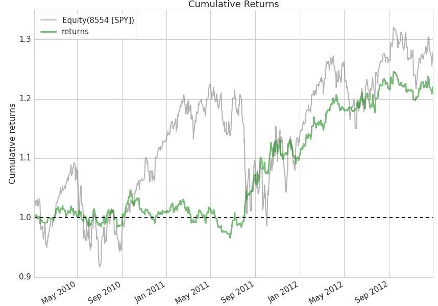

The strategies fail to take advantage of the bull trend in 2011 however 2012 proves much more fruitful.

**2013-15**

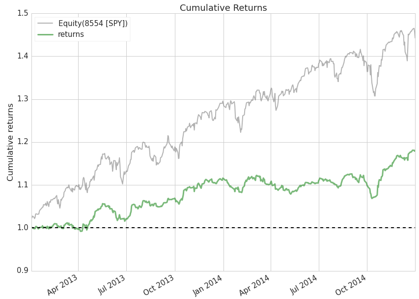

Moving onto the out-of-sample period we see a very strong performance, consistent stable returns. Sharp drops have been dulled whilst returns have been generated at most opportunities.

**2015-Sept**

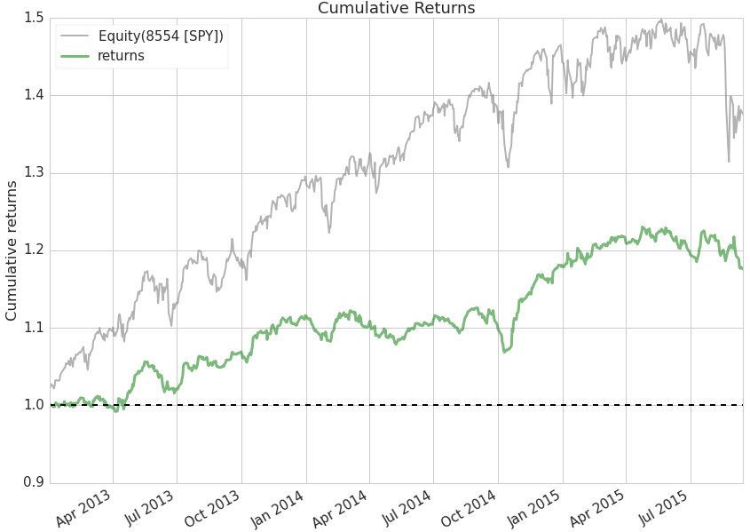

This a repeat of the previous backtest but including the market top of 2015 and the "Black Monday" event that hit China and the rest of the world (1000pt drop in Dow Jones). It is very key to not the performance at the far right of the chart. 

Although in reality any position that may have been opened or closed on that day reaslistically would have been affected by market moves and slippage would have taken the toll. However its clear to note the inital sharp drop was not felt severely by the algorithm, it only forms the second largest drawdown (around 4%).

##4. Review of Results

Here we review a selection of the strongest backtests side by side with commentary:

| Metric Annualised | Mean Reversion | Momentum | Pairs Trading | Mean & Pairs | Momentum & Pairs | Mean & Momentum | Mean & Mom Rebalanced | All Strategies | All Strategies Rebalanced |
|-------------------|----------------|----------|---------------|--------------|------------------|-----------------|-----------------------|----------------|---------------------------|
| Return            | 0.08           | 0.12     | 0.04          | 0.06         | 0.08             | 0.08            | 0.10                  | 0.07           | 0.08                      |
| Volatility        | 0.17           | 0.15     | 0.07          | 0.09         | 0.08             | 0.11            | 0.1                   | 0.08           | 0.08                      |
| Sharpe            | 0.45           | 0.79     | 0.63          | 0.65         | 0.99             | 0.76            | 1.02                  | 0.93           | 1.06                      |
| Calmar            | 0.23           | 0.45     | 0.3           | 0.34         | 0.7              | 0.63            | 0.84                  | 0.91           | 0.95                      |
| Stability         | 0.66           | 0.93     | 0.77          | 0.81         | 0.96             | 0.95            | 0.94                  | 0.96           | 0.95                      |
| Max Drawdown      | 0.33           | 0.27     | 0.14          | 0.17         | 0.12             | 0.13            | 0.12                  | 0.08           | 0.09                      |
| Omega Ratio       | 1.08           | 1.16     | 1.14          | 1.12         | 1.19             | 1.15            | 1.22                  | 1.19           | 1.22                      |
| Sortino Ratio     | 0.72           | 1.08     | 0.85          | 1.06         | 1.43             | 1.28            | 1.58                  | 1.56           | 1.64                      |
| Skewness          | 0.47           | 0.03     | 0.5           | 0.46         | 0.04             | 0.68            | 0.6                   | 0.6            | 0.53                      |
| Kurtosis          | 4.38           | 3.45     | 7.44          | 4.09         | 2.52             | 4.26            | 8.54                  | 3.77           | 6.53                      |
| Alpha             | 0.08           | 0.07     | 0.04          | 0.06         | 0.07             | 0.08            | 0.1                   | 0.07           | 0.07                      |
| Beta              | -0.12          | 0.43     | 0.0           | -0.06        | 0.22             | 0.12            | 0.07                  | 0.08           | 0.09                      |

**To summarise the above table we have a few key points, moving from left to right:**

1. Reversion strategy returns are negatively correlatd to market returns and has lowest stability and Sharpe
2. Momentum strategy is highly correlated with market returns and has high stability and returns
3. Pairs strategy has no correlation to the market and has the lowest volatility and max drawdown
4. Combining the various stategies appears to average out weaknesses and strengths resulting in a more consistent performance

---
**We find there are three top performing strategies:**

* Momentum & Pairs
* Mean & Momentum Rebalanced
* All Strategies Rebalanced

1. Comparing Momentum & Pairs vs other two strategies, we see the following key points:
    * Joint largest Max Drawdown 
    * Lowest Calmar, Sharpe, Sortino, Omega ratio
    * Highest Stability
2. Comparing Mean Revesion & Momentum Rebalanced vs other two strategies, we see the following key points:
    * Joint largest Max Drawdown
    * Largest Alpha and lowest Beta
    * Highest Volatility
    * Lowest Stability
    * Largest Kurtosis of returns, but the most positive Skew
3. Comparing All Strategies Rebalanced vs other two strategies, we see the following key points:
    * Joint lowest Volatility
    * Highest Sharpe, Calmar, Sortino
    * Joint highest Omega
    * Lowest Max Drawdown

**Conclusion:**

Although it seems extremely close between Mean Reversion & Momentum Rebalanced and All Strategies Rebalanced, to examine the data carefully shows we have sacrificed Alpha and returns for stability and consistency. We are in search of leveraged returns which yields superior returns for each unit of risk added. The various ratio metrics highlight how returns are being generated on a better risk adjusted basis. 

---
###Overall:

We have combined relatively diversified strategies together and shared the portfolio control equally between the three with dynamic rebalancing between the Mean Reversion and Momentum strategy, this has lead to an **improved risk adjusted returns** stream as measured by Stability, Sharpe, and Max Drawdown along with the other metrics in the table above.

###Yearly Breakdown of Performance

Under the column "Yearly Cont." we have the **actual performance** of the strategy when run over the total time period, this is the true reflection of the metrics. 

However breaking down the algorithm over one year periods causes it to vastly underperform with this "stop-start" style operation, this would not be done like this in reality (this is not what the algorithm is designed for) however it is useful to see relative performance and underperformance in an illustrative fashion. External testing outside of this notebook has proven that the dynamic rebalancing without warmup compounds this underperformance potentially due to the warmup period for the rebalancing.

These metrics could possibly be seen as the worst case (Big 'O') scenario for the algorithm. In this table the returns compound to roughly 55% with inferior metrics whilst correct algorithm operation compounds to over 86% with superior quality of returns.

| Metric Annualised | Yearly Cont. | 07-08 | 08-09 | 09-10 | 10-11 | 11-12 | 12-13 | 13-14 | 14-15 | 15-"China's Black Monday" |
|-------------------|--------------|-------|-------|-------|-------|-------|-------|-------|-------|---------------------------|
| Return            | 0.08         | 0.07  | 0.04  | 0.01  | 0.01  | 0.16  | 0.05  | 0.11  | 0.04  | -0.03                     |
| Volatility        | 0.08         | 0.06  | 0.11  | 0.12  | 0.14  | 0.10  | 0.06  | 0.06  | 0.05  | 0.06                      |
| Sharpe            | 1.06         | 1.16  | 0.35  | 0.07  | 0.07  | 1.67  | 0.79  | 1.97  | 0.78  | -0.55                     |
| Calmar            | 0.95         | 2.83  | 0.61  | 0.07  | 0.17  | 2.98  | 1.37  | 2.89  | 0.85  | -0.74                     |
| Stability         | 0.95         | 0.74  | 0.23  | 0.02  | 0.07  | 0.65  | 0.52  | 0.90  | 0.30  | 0.02                      |
| Max Drawdown      | 0.09         | 0.03  | 0.06  | 0.10  | 0.05  | 0.06  | 0.04  | 0.04  | 0.05  | 0.04                      |
| Omega Ratio       | 1.22         | 1.21  | 1.06  | 1.01  | 1.03  | 1.34  | 1.14  | 1.39  | 1.15  | 0.91                      |
| Sortino Ratio     | 1.64         | 2.00  | 0.55  | 0.11  | 0.20  | 3.33  | 1.48  | 3.22  | 1.68  | -0.93                     |
| Skewness          | 0.53         | 0.07  | 0.19  | 0.55  | 0.08  | 0.8   | 0.41  | -0.04 | 1.61  | 0.52                      |
| Kurtosis          | 6.53         | 0.97  | 2.84  | 1.10  | 1.59  | 2.28  | 0.92  | 1.02  | 7.49  | 1.03                      |
| Alpha             | 0.07         | 0.07  | 0.04  | 0.02  | -0.01 | 0.16  | 0.03  | 0.01  | 0.02  | -0.03                     |
| Beta              | 0.09         | 0.01  | 0.01  | 0.12  | 0.17  | -0.01 | 0.11  | 0.36  | 0.15  | 0.05                      |

###Performance Against Benchmark

It is of my opinion that comparing a multi strategy algorithm against an index is illogical, however this is industry standard, especially for outside investors, who may rate the performance of a portfolio against a buy-and-hold return of the S&P 500. For this reason I have written up all of my analysis against the standard benchmark. However in the image below you can see the **unleveraged performance** against an ETF which tracks Multi-Strategy Hedge Fund performance, you can see more about this [here](https://uk.finance.yahoo.com/q/pr?s=QAI). This is by no means perfect, however it a step toward reflecting the institutional performance. 

*As a side note: I personally disagree with the ideaology of "out performing the benchmark", this would be an unrealistic bonus, whilst unleveraged, rather than a target. Instead the intelligent investor will ideally seek consistent and reliable compounding of wealth above the risk free rate. Arguablly this has been easy to achieve over the past 7/8 years due to experimental monetary policy and ZIRP specifically. It seems market regieme change is frequent and considerable, this is a blessing for Speculative Traders and a curse for Quantitiative Traders, however in my opinion uncertainty is opportunity.*

    # 2010 - 2015 - Since ETF Inception 
    test = get_backtest('55f81c0359cf920df908961f')
    test.create_full_tear_sheet()

    100% Time: 0:00:10|###########################################################|
    Entire data start date: 2010-01-04 00:00:00+00:00
    Entire data end date: 2014-12-31 00:00:00+00:00
    
    
    Backtest Months: 59
                       Backtest
    annual_return          0.08
    annual_volatility      0.07
    sharpe_ratio           1.10
    calmar_ratio           1.03
    stability              0.94
    max_drawdown          -0.08
    omega_ratio            1.22
    sortino_ratio          1.77
    skewness               0.51
    kurtosis               3.15
    alpha                  0.07
    beta                   0.42
    
    Worst Drawdown Periods
       net drawdown in %                  peak date                valley date  \
    0               7.70  2010-09-24 00:00:00+00:00  2011-06-24 00:00:00+00:00   
    1               5.08  2014-09-02 00:00:00+00:00  2014-10-10 00:00:00+00:00   
    4               3.90  2012-09-14 00:00:00+00:00  2012-11-13 00:00:00+00:00   
    2               3.88  2014-03-05 00:00:00+00:00  2014-05-09 00:00:00+00:00   
    3               3.75  2013-05-17 00:00:00+00:00  2013-06-28 00:00:00+00:00   
    
                   recovery date duration  
    0  2011-08-26 00:00:00+00:00      241  
    1  2014-10-31 00:00:00+00:00       44  
    4  2013-01-02 00:00:00+00:00       79  
    2  2014-08-22 00:00:00+00:00      123  
    3  2013-08-01 00:00:00+00:00       55  
    
    
    2-sigma returns daily    -0.009
    2-sigma returns weekly   -0.018
    dtype: float64
    
    Stress Events
                                        mean    min    max
    US downgrade/European Debt Crisis  0.002 -0.014  0.022
    Fukushima                          0.000 -0.004  0.009
    EZB IR Event                      -0.000 -0.008  0.012
    Flash Crash                        0.001 -0.006  0.009
    Apr14                             -0.000 -0.011  0.004
    Oct14                              0.001 -0.009  0.020
    
    
    Top 10 long positions of all time (and max%)
    [u'QQQ' u'SPY' u'KO' u'PEP']
    [ 0.582  0.541  0.13   0.129]
    
    
    Top 10 short positions of all time (and max%)
    [u'SPY' u'KO' u'PEP']
    [-0.26  -0.135 -0.132]
    
    
    Top 10 positions of all time (and max%)
    [u'QQQ' u'SPY' u'KO' u'PEP']
    [ 0.582  0.541  0.135  0.132]
    
    
    All positions ever held
    [u'QQQ' u'SPY' u'KO' u'PEP']
    [ 0.582  0.541  0.135  0.132]
    
    
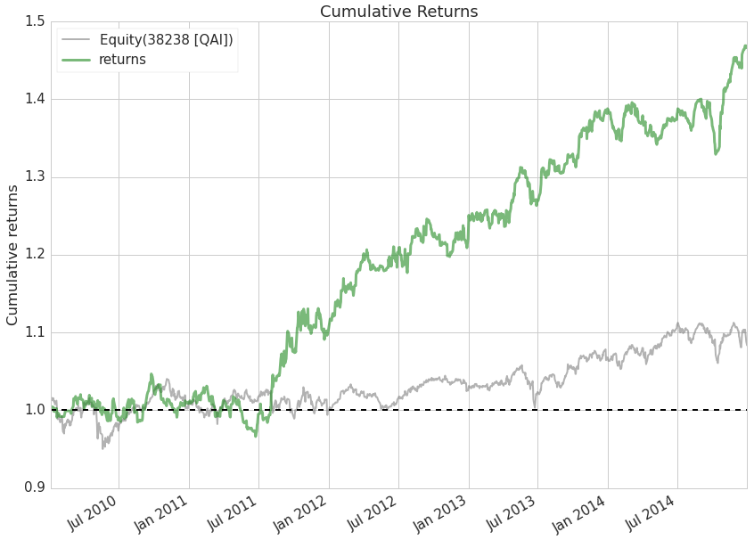

Against the ETF benchmark we see a far superior unleveraged performance. It must be made clear that the hedge fund industry is becoming more crowded, and within the benchmark there will be some components that vastly out/under perform so representing an average performance. We can see that despite this algorithm being extremely basic in construction with very simplistic and "proof-of-concept" style design and strategies, it is not without purpose. Compounding at over 8% per year with a Sharpe Ratio just under 1.5 in the out-of-sample period.
